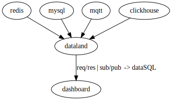

# dataland
Data Aggregation SQL Platform 数据聚合平台 提供统一的接口给前端可视化使用

# 逻辑图

| 数据源  | 版本 |
|---| ---|
|redis| ---|
|mysql| ---|
|clickhouse| ---|
|rest| ---|
|excel| ---|
|http| ---|
|tcp| ---|
|udp| ---|
|file| ---|
|grpc| ---|
|dataland| ---|

